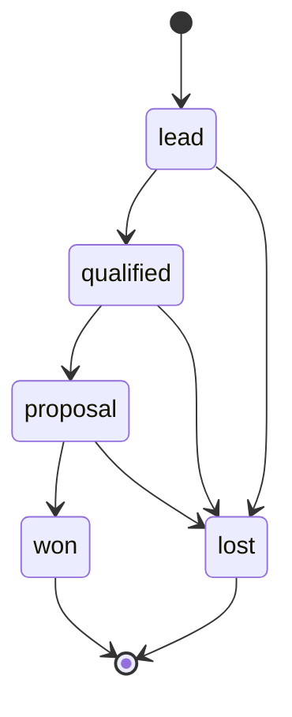
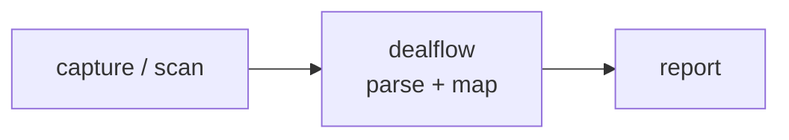

<a name="top"></a>
<div align="center">


# DEALFLOW

### Model your sales pipeline as a YAML state machine and compute conversion rates, stage velocity, and weighted forecast straight from CRM exports.


[](https://pypi.org/project/cognis-dealflow/) [](https://github.com/cognis-digital/dealflow/actions) [](LICENSE) [](https://github.com/cognis-digital)

*Part of the Cognis Neural Suite.*

</div>

```bash
pip install cognis-dealflow
dealflow scan .            # → prioritized findings in seconds
```


<!-- cognis:example:start -->

## Watch the walkthrough

A full narrated tour — setup, the tool in action, and every demo scenario:

[](https://github.com/cognis-digital/dealflow/releases/download/walkthrough-v1/walkthrough.mp4)

▶ **[Watch the walkthrough (MP4)](https://github.com/cognis-digital/dealflow/releases/download/walkthrough-v1/walkthrough.mp4)**

## 🔎 Example output

Real, reproducible output from the tool — runs offline:

```console
$ dealflow-emit --version
dealflow 0.1.0
```

```console
$ dealflow-emit --help
usage: dealflow [-h] [--version] <command> ...

Model a sales pipeline as a YAML state machine and compute conversion, velocity, and a weighted forecast from a CSV deal log. Pipeline-as-code: a reproducible forecast artifact for CI.

positional arguments:
  <command>
    forecast  compute conversion/velocity/forecast from a pipeline + deal log

options:
  -h, --help  show this help message and exit
  --version   show program's version number and exit

example:
  dealflow forecast -p pipeline.yml -d deals.csv
  dealflow forecast -p pipeline.yml -d deals.csv --format json --min-forecast 100000
```

> Blocks above are real `dealflow` output — reproduce them from a clone.

**Sample result format** _(illustrative values — run on your own data for real findings):_

```
{"findings": [
    {
      "id": "1234567890",
      "title": "Suspicious Activity Detected",
      "description": "An attacker was detected attempting to access a sensitive system.",
      "labels": ["suspicious", "malware"],
      "created_at": "2023-02-20T14:30:00Z"
    }
  ]
}
```

<!-- cognis:example:end -->

## Usage — step by step

1. Install the CLI (Python 3.9+):

   ```bash
   pip install dealflow       # or: pip install .   from a checkout
   ```

2. Forecast a pipeline — the `forecast` subcommand models a YAML pipeline state machine against a CSV deal event log and computes conversion, velocity, and a weighted forecast:

   ```bash
   dealflow forecast --pipeline pipeline.yml --deals deals.csv
   ```

3. Emit machine-readable output for piping / dashboards:

   ```bash
   dealflow forecast -p pipeline.yml -d deals.csv --format json | jq .weighted_forecast
   ```

4. Read the result via exit code — `0` success, `1` a gate failed, `2` usage/parse/data error. Apply CI gates on the forecast or win rate:

   ```bash
   dealflow forecast -p pipeline.yml -d deals.csv --min-forecast 100000 --min-win-rate 0.25
   ```

5. Run it as a reproducible forecast artifact in CI — the pipeline fails when the weighted forecast drops below target:

   ```bash
   dealflow forecast -p pipeline.yml -d deals.csv --min-forecast 100000 || echo "pipeline below target"
   ```


## Contents

- [Why dealflow?](#why) · [Features](#features) · [Quick start](#quick-start) · [Example](#example) · [Demos](#demos) · [Architecture](#architecture) · [AI stack](#ai-stack) · [How it compares](#how-it-compares) · [Integrations](#integrations) · [Install anywhere](#install-anywhere) · [Related](#related) · [Contributing](#contributing)

<a name="why"></a>
## Why dealflow?

Pipeline-as-code: your forecast is a reproducible artifact in CI, so board decks come from a committed file instead of a manually massaged spreadsheet.

`dealflow` is single-purpose, scriptable, and self-hostable: point it at a target, get prioritized results in the format your workflow already speaks (table · JSON · SARIF), gate CI on it, and let agents drive it over MCP.

<div align="right"><a href="#top">↑ back to top</a></div>

<a name="features"></a>
## Features

- ✅ Model a pipeline as a YAML state machine (open / won / lost stages)
- ✅ Load a CSV deal event log (tolerant of mixed date & `$1,200`-style amounts)
- ✅ Per-stage conversion (advance rate) and velocity (avg days in stage)
- ✅ Risk-adjusted weighted forecast over open deals
- ✅ Three output formats: `table`, `json`, **`csv`** (per-deal export for spreadsheets/BI/CRM import)
- ✅ CI gates: `--min-forecast` / `--min-win-rate` with exit codes
- ✅ Runs on Linux/macOS/Windows · Docker · devcontainer
- ✅ Ports in Python, JavaScript, Go, and Rust (`ports/`)

**Capital-matchmaking + strategic-teaming engine** — the open, self-hostable
answer to boutique "capital matchmaking" and "strategic teaming" advisory:

- ✅ **Explainable fit scoring** (`match`) — rank capital sources against a
  company/tech profile with a transparent, weighted **factor breakdown** (stage,
  check size, sector thesis, geography, mandate, dilution, dual-use, TRL). Not a
  black box: every score reconciles to named factors, each with a reason.
- ✅ **Capital-source taxonomy** (`sources`) — an extensible catalog of funding
  vehicles (SBIR/STTR, OTA prototype, APFIT, defense VC, strategic CVC,
  In-Q-Tel-style, grants, project finance, venture debt) with size, dilution,
  timeline, and fit heuristics. Merge your own private entries over the seed.
- ✅ **Teaming graph** (`team`) — model primes/subs/small businesses, set-aside
  status (8(a)/SDVOSB/HUBZone/WOSB), and complementary capabilities; recommend a
  team that covers an opportunity's requirements with a **gap analysis**.
- ✅ **Capture pipeline** (`pipeline`) — probability-weighted opportunity tracker
  with stage playbooks, staleness flags, and next-action prompts.
- ✅ **Self-contained reports** (`report`) — single-file HTML match reports and
  teaming briefs (no JS, no CDN — open offline) plus CSV/JSON export.

See **[docs/MATCHMAKING.md](docs/MATCHMAKING.md)** for the full guide.

<div align="right"><a href="#top">↑ back to top</a></div>

<a name="quick-start"></a>
## Quick start

```bash
pip install cognis-dealflow
dealflow --version
# --- historical forecast ---
dealflow forecast -p pipeline.yml -d deals.csv                 # human table
dealflow forecast -p pipeline.yml -d deals.csv --format json   # machine-readable
dealflow forecast -p pipeline.yml -d deals.csv --format csv    # per-deal export
dealflow forecast -p pipeline.yml -d deals.csv --min-forecast 100000  # CI gate

# --- capital matchmaking + strategic teaming ---
dealflow match  -c company.yml                         # rank funding sources by explainable fit
dealflow match  -c company.yml --explain               # + full factor breakdown per source
dealflow sources --category equity-vc                  # browse the capital-source taxonomy
dealflow team   -o opportunity.yml -r roster.yml       # recommend a team + gap analysis
dealflow pipeline -f pipeline.yml                      # opportunity/capture tracker
dealflow report match -c company.yml -o match.html     # self-contained HTML report (no JS/CDN)
dealflow report team  -o opportunity.yml -r roster.yml --out brief.html
```

<div align="right"><a href="#top">↑ back to top</a></div>

<a name="example"></a>
## Example

```text
$ dealflow forecast -p pipeline.yml -d deals.csv
Pipeline: B2B Sales
Deals: 6 total | 3 open | 2 won | 1 lost
Win rate (decided): 66.7%

Stage breakdown:
  STAGE            ENTER  ADV   ADV%  AVG_DAYS   P(WIN)
  -----------------------------------------------------
  lead                 6    5    83%      10.4      33%
  qualified            5    3    60%      12.2      40%
  proposal             3    2    67%      12.5      67%

Forecast:
  Open pipeline value : $60,000
  Won value (closed)  : $80,000
  Weighted forecast   : $27,667
```

Or export per-deal rows straight into a spreadsheet / BI tool:

```text
$ dealflow forecast -p pipeline.yml -d deals.csv --format csv
deal_id,current_stage,status,amount,p_win,expected_value,age_days
D3,proposal,open,20000.0,0.6667,13333.33,25
...
```

<div align="right"><a href="#top">↑ back to top</a></div>

<a name="demos"></a>
## Demos — real use cases

Two flavors ship in [`demos/`](demos/). **Narrated Python scenarios**
(`NN_name.py`) each target a different audience and drive the *real* dealflow
API offline against a bundled sample — clear narrated output, exit 0, so they
double as smoke tests. **Data scenarios** (`NN-name/`) are a pipeline YAML + CSV
deal log + `SCENARIO.md` you run straight through the CLI. All are verified to
run. Full details in [`docs/DEMOS.md`](docs/DEMOS.md).

```sh
PYTHONUTF8=1 python demos/run_all.py            # all five narrated scenarios
PYTHONUTF8=1 python demos/02_revops_funnel.py   # or just one
```

| Narrated scenario | Audience | Shows |
|---|---|---|
| [`01_founder_forecast.py`](demos/01_founder_forecast.py) | Founders / sales leaders | Raw pipeline vs. risk-adjusted weighted forecast — the board number from git |
| [`02_revops_funnel.py`](demos/02_revops_funnel.py) | RevOps | Per-stage advance rate + velocity → find the leak and the bottleneck |
| [`03_bd_rep_deals.py`](demos/03_bd_rep_deals.py) | BD reps / AEs | Open-deal worklist ranked by expected value, plus stalled deals |
| [`04_finance_ci_gate.py`](demos/04_finance_ci_gate.py) | Finance / forecasting | `--min-forecast` as a CI tripwire: gate passes (0) / fails the build (1) |
| [`05_analyst_csv_export.py`](demos/05_analyst_csv_export.py) | Data analysts / BI | `--format csv` per-deal export, reconciled against the engine forecast |
| [`19_capital_matchmaking.py`](demos/19_capital_matchmaking.py) | Founders / capital raise | Explainable fit scoring: rank funding sources with a factor breakdown |
| [`20_growth_stage_matching.py`](demos/20_growth_stage_matching.py) | Growth-stage operators | Same engine, a Series B profile — the ranking inverts, driven by the profile |
| [`21_capital_source_taxonomy.py`](demos/21_capital_source_taxonomy.py) | Capital advisors | Browse the funding-vehicle taxonomy and merge a private fund over the seed |
| [`22_strategic_teaming.py`](demos/22_strategic_teaming.py) | Capture managers | Assemble a compliant team covering an opportunity + set-aside goals |
| [`23_teaming_gap_analysis.py`](demos/23_teaming_gap_analysis.py) | BD leads | Bid / team / walk — the go/no-go signal from a coverage gap analysis |
| [`24_capture_pipeline.py`](demos/24_capture_pipeline.py) | BD / capture leads | Probability-weighted pipeline + staleness flags + next-action prompts |
| [`25_match_report_html.py`](demos/25_match_report_html.py) | Anyone sharing results | Self-contained HTML match report + teaming brief (no JS/CDN) + CSV |
| [`26_teaming_graph_edges.py`](demos/26_teaming_graph_edges.py) | Partnering leads | The teaming graph's complementary-capability edges, opportunity-agnostic |

The deal state machine each scenario walks:



Self-contained **data scenarios** (run through the CLI):

| Demo | Scenario |
|---|---|
| [`01-basic`](demos/01-basic/) | 5-stage B2B forecast — the canonical walkthrough |
| [`02-saas-monthly`](demos/02-saas-monthly/) | SaaS funnel with a procurement/legal stage where deals stall |
| [`03-enterprise-longcycle`](demos/03-enterprise-longcycle/) | Enterprise field sales, long cycles, two distinct loss reasons |
| [`04-inbound-velocity`](demos/04-inbound-velocity/) | High-volume self-serve funnel — velocity in days, not months |
| [`05-quarterly-gate`](demos/05-quarterly-gate/) | Fail CI when the quarterly weighted forecast drops below target |
| [`06-stalled-deals`](demos/06-stalled-deals/) | Surface aging/stalled deals via the `age_days` column |
| [`07-minimal-noamount`](demos/07-minimal-noamount/) | Smallest input: string stages, no amounts → conversion-only view |
| [`08-csv-export-bi`](demos/08-csv-export-bi/) | `--format csv` per-deal export for spreadsheets / BI |
| [`09-mixed-dateformats`](demos/09-mixed-dateformats/) | Stitch exports with mixed date & `$1,200`-style currency formats |

```sh
# Run any demo:
python -m dealflow forecast -p demos/02-saas-monthly/pipeline.yml \
                            -d demos/02-saas-monthly/deals.csv
```

<div align="right"><a href="#top">↑ back to top</a></div>

<a name="architecture"></a>
## Architecture



<div align="right"><a href="#top">↑ back to top</a></div>

<a name="ai-stack"></a>
## Use it from any AI stack

`dealflow` is interoperable with every popular way of using AI:

- **MCP server** — `dealflow mcp` (Claude Desktop, Cursor, Cognis.Studio, [uncensored-fleet](https://github.com/cognis-digital/uncensored-fleet))
- **OpenAI-compatible / JSON** — pipe `dealflow scan . --format json` into any agent or LLM
- **LangChain · CrewAI · AutoGen · LlamaIndex** — wrap the CLI/JSON as a tool in one line
- **CI / scripts** — exit codes + SARIF for non-AI pipelines

<div align="right"><a href="#top">↑ back to top</a></div>

<a name="how-it-compares"></a>
## How it compares

| | **Cognis dealflow** | dbt metrics layer crossed with Clari-style revenue forecasting |
|---|:---:|:---:|
| Self-hostable, no account | ✅ | varies |
| Single command, zero config | ✅ | ⚠️ |
| JSON + SARIF for CI | ✅ | varies |
| MCP-native (AI agents) | ✅ | ❌ |
| Polyglot ports (JS/Go/Rust) | ✅ | ❌ |
| Open license | ✅ COCL | varies |

*Built in the spirit of **dbt metrics layer crossed with Clari-style revenue forecasting**, re-framed the Cognis way. Missing a credit? Open a PR.*

### Capital matchmaking + strategic teaming vs. boutique advisory

The `match` / `sources` / `team` / `pipeline` / `report` engine is the open,
self-hostable answer to fee-based "capital matchmaking" and "strategic teaming"
advisory services that pair defense startups with funding and primes with subs:

| | **Cognis dealflow** | Boutique matchmaking/teaming advisory |
|---|:---:|:---:|
| Self-hostable, you own the data | ✅ | ❌ |
| Explainable score (factor breakdown, not a black box) | ✅ | ⚠️ opaque |
| Extensible funding-vehicle taxonomy | ✅ | ❌ proprietary |
| Teaming graph + set-aside-aware gap analysis | ✅ | ⚠️ manual |
| Offline / air-gap friendly | ✅ | ❌ |
| Runs in CI, scriptable, MCP-native | ✅ | ❌ |
| Cost | ✅ open | 💰 retainer |

<div align="right"><a href="#top">↑ back to top</a></div>

<a name="integrations"></a>
## Integrations

Pipes into your stack: **SARIF** for code-scanning, **JSON** for anything, an **MCP server** (`dealflow mcp`) for AI agents, and a webhook forwarder for SIEM/Slack/Jira. See [`docs/INTEGRATIONS.md`](docs/INTEGRATIONS.md).

<div align="right"><a href="#top">↑ back to top</a></div>

<a name="install-anywhere"></a>
## Install — every way, every platform

```bash
pip install "git+https://github.com/cognis-digital/dealflow.git"    # pip (works today)
pipx install "git+https://github.com/cognis-digital/dealflow.git"   # isolated CLI
uv tool install "git+https://github.com/cognis-digital/dealflow.git" # uv
pip install cognis-dealflow                                          # PyPI (when published)
docker run --rm ghcr.io/cognis-digital/dealflow:latest --help        # Docker
brew install cognis-digital/tap/dealflow                             # Homebrew tap
curl -fsSL https://raw.githubusercontent.com/cognis-digital/dealflow/main/install.sh | sh
```

| Linux | macOS | Windows | Docker | Cloud |
|---|---|---|---|---|
| `scripts/setup-linux.sh` | `scripts/setup-macos.sh` | `scripts/setup-windows.ps1` | `docker run ghcr.io/cognis-digital/dealflow` | [DEPLOY.md](docs/DEPLOY.md) (AWS/Azure/GCP/k8s) |

<div align="right"><a href="#top">↑ back to top</a></div>

<a name="related"></a>
## Related Cognis tools

- [`warmline`](https://github.com/cognis-digital/warmline) — Score and rank inbound/outbound leads from a YAML rulebook, emitting a ranked queue as JSON/CSV for your SDRs and CI gates.
- [`coldforge`](https://github.com/cognis-digital/coldforge) — Render personalized cold-outreach sequences from Markdown templates + a contacts CSV, with spam-score linting and per-send dry-run preview.
- [`pactgen`](https://github.com/cognis-digital/pactgen) — Generate branded sales proposals and SOWs from a YAML scope file + pricing table into PDF/HTML, with a deterministic line-item math check.
- [`crmsync`](https://github.com/cognis-digital/crmsync) — Bidirectional, idempotent sync of contacts/deals between a local SQLite source-of-truth and CRM APIs (HubSpot/Pipedrive/Salesforce) via one config.
- [`dripcheck`](https://github.com/cognis-digital/dripcheck) — Lint email sequences and drip campaigns for deliverability: SPF/DKIM/DMARC, link health, unsubscribe presence, and CAN-SPAM/GDPR compliance.
- [`introbot`](https://github.com/cognis-digital/introbot) — Find warm-intro paths through your team's combined network graph and draft double-opt-in intro requests from a single contacts manifest.

**Explore the suite →** [🗂️ all 170+ tools](https://github.com/cognis-digital/cognis-neural-suite) · [⭐ awesome-cognis](https://github.com/cognis-digital/awesome-cognis) · [🔗 cognis-sources](https://github.com/cognis-digital/cognis-sources) · [🤖 uncensored-fleet](https://github.com/cognis-digital/uncensored-fleet) · [🧠 engram](https://github.com/cognis-digital/engram)

<div align="right"><a href="#top">↑ back to top</a></div>

<a name="contributing"></a>
## Contributing

PRs, new rules, and demo scenarios are welcome under the collaboration-pull model — see [CONTRIBUTING.md](CONTRIBUTING.md) and [SECURITY.md](SECURITY.md).

> ### ⭐ If `dealflow` saved you time, **star it** — it genuinely helps others find it.

## Interoperability

`{}` composes with the 300+ tool Cognis suite — JSON in/out and a shared
OpenAI-compatible `/v1` backbone. See **[INTEROP.md](INTEROP.md)** for the
suite map, composition patterns, and reference stacks.

## License

Source-available under the **Cognis Open Collaboration License (COCL) v1.0** — free for personal, internal-evaluation, research, and educational use; **commercial / production use requires a license** (licensing@cognis.digital). See [LICENSE](LICENSE).

---

<div align="center"><sub><b><a href="https://cognis.digital">Cognis Digital</a></b> · one of 170+ tools in the <a href="https://github.com/cognis-digital/cognis-neural-suite">Cognis Neural Suite</a> · <i>Making Tomorrow Better Today</i></sub></div>
