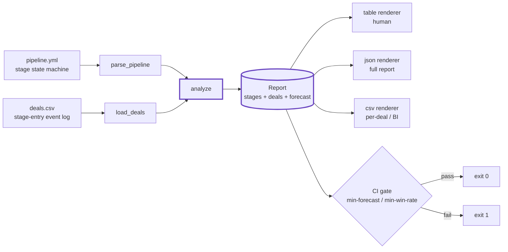
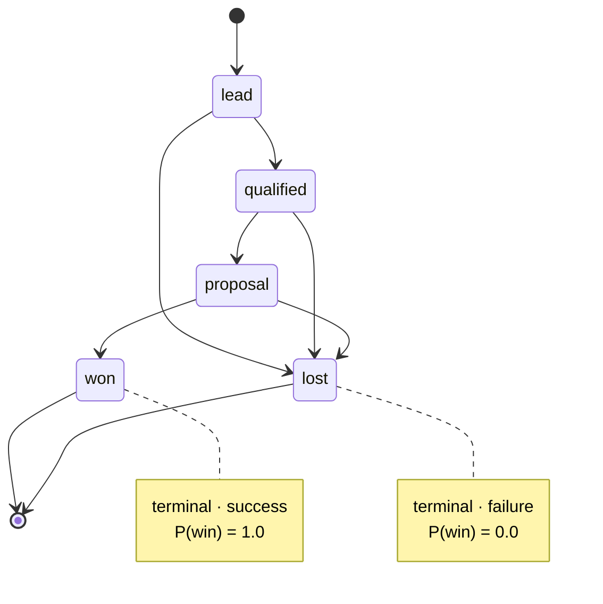
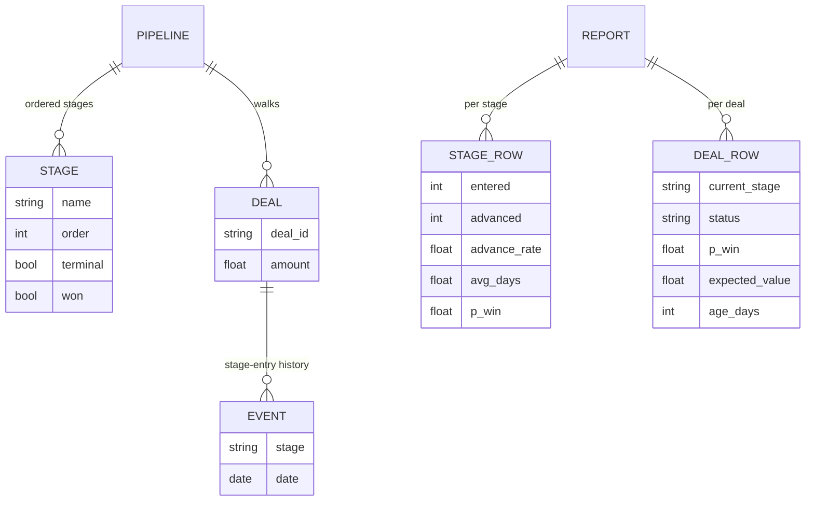

# Architecture

`dealflow` turns a sales pipeline into a queryable state machine and computes a
reproducible, risk-adjusted forecast from a CRM export. No daemon, no database,
no network — a YAML file in, a deterministic report out. This document explains
how the pieces fit together, end to end.

## The pipeline

## The deal state machine

A pipeline is a directed state machine of ordered stages. Every deal walks it
over time; the CSV records each stage-entry as a dated event. Open stages flow
forward; two terminal kinds of stage absorb deals — one `won`, one or more
`lost`.

For each open stage the engine measures the team's own history:

- **advance rate** = `advanced / entered` — the fraction of deals that entered
  the stage and later reached a strictly later stage.
- **velocity** = average days a deal spends in the stage before leaving it.
- **P(win | stage)** = the product of advance rates from that stage through to
  the won stage, so probability is monotonic along the pipeline.

The **weighted forecast** is then `Σ amount × P(win | current_stage)` over every
open deal — the optimistic open-pipeline value discounted by the team's real
conversion history.

## Components

### Core engine (`dealflow/core.py`)
The whole model lives here, dependency-free.

- `parse_pipeline(text)` / `load_pipeline(path)` — parse the YAML state machine.
  Includes a small, deliberately-restricted **stdlib YAML subset parser** so
  there is no third-party dependency. Stages may be bare strings or mappings
  with a `type` (`open` / `won` / `lost`); if no `won` is declared, the last
  stage becomes the won stage.
- `load_deals(path | text)` — read the CSV event log (columns `deal_id, stage,
  date[, amount]`, case-insensitive). Tolerant of mixed date formats
  (`YYYY-MM-DD`, `MM/DD/YYYY`, …) and `$1,200`-style amounts; histories are
  sorted chronologically per deal.
- `analyze(pipeline, deals)` — the math above, returning a `Report` with
  per-stage rows, per-deal rows, and the headline aggregates.

### Data model

### CLI (`dealflow/cli.py`)
The `forecast` subcommand wires `load_pipeline` + `load_deals` + `analyze` to
three renderers — `table` (human), `json` (full `Report.to_dict()`), and `csv`
(per-deal rows for spreadsheets / BI / CRM import). The `--min-forecast` and
`--min-win-rate` flags turn the forecast into a **CI gate** via exit codes:
`0` pass, `1` gate failed, `2` usage/parse/data error.

### MCP server (`dealflow/mcp_server.py`)
Exposes the same forecast to AI agents as an MCP tool, so an assistant can read
the live pipeline number without a human running the CLI.

### Connect / emit (`dealflow/connect.py`)
The `dealflow-emit` entry point and Cognis-suite interop adapter (JSON in/out).

## Why these choices

- **Pipeline-as-code.** The forecast is a function of two committed files, so a
  board number is reproducible from a clone instead of a hand-massaged slide.
- **No dependencies, no server.** Pure stdlib (including the YAML subset). The
  tool is a file you can copy, diff, and run anywhere Python runs.
- **Offline and private.** Your CRM export never leaves the machine; nothing is
  sent to a vendor or used to train a model.
- **Deterministic by construction.** Same inputs → same forecast, every time —
  which is exactly what makes the CI gate meaningful.

## Extend it

Add a rule or scenario: drop a new `demos/NN-*/` (pipeline.yml + deals.csv +
SCENARIO.md), or a narrated Python scenario in `demos/NN_name.py`, plus a test.
See [CONTRIBUTING.md](../CONTRIBUTING.md) and [DEMOS.md](DEMOS.md).
